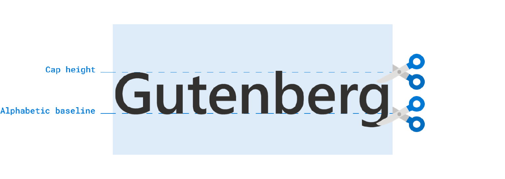
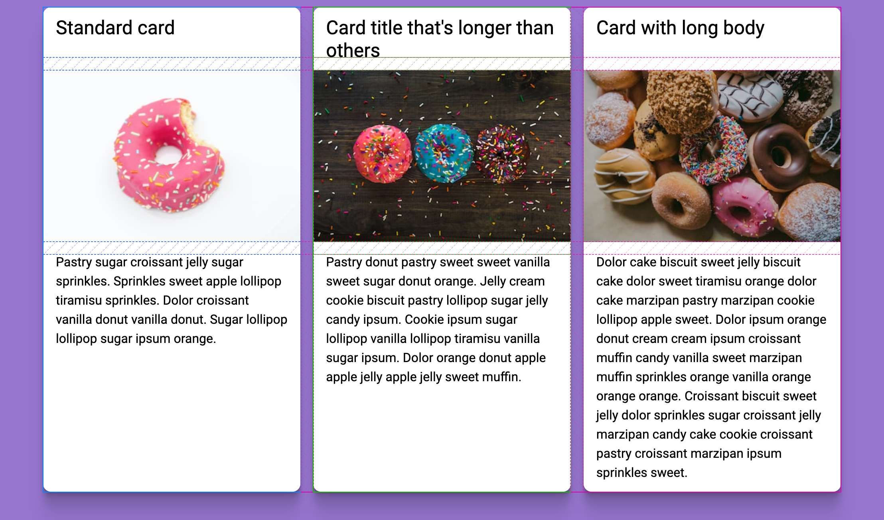
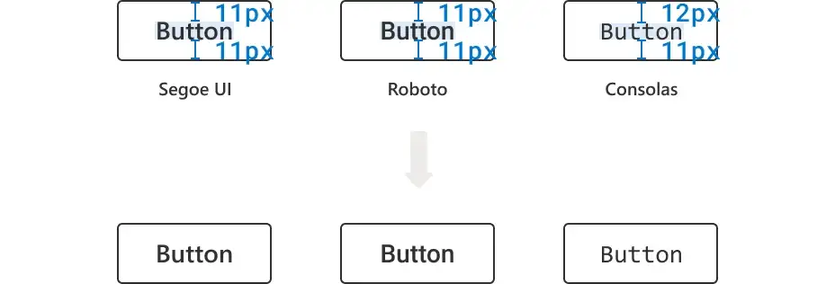
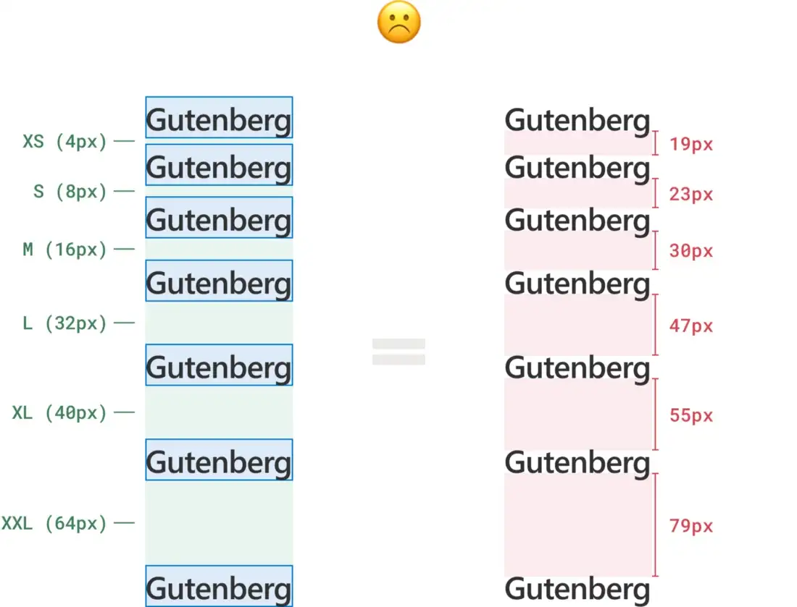
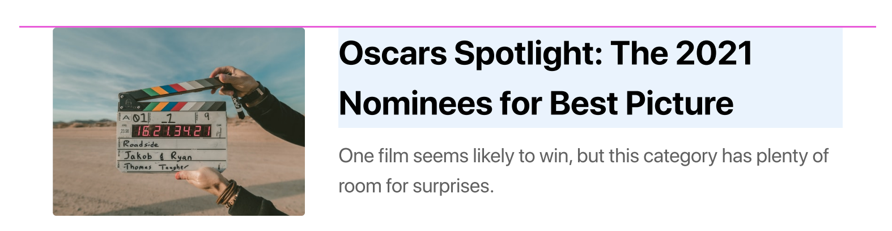

#  CSS Text Box Trim

CSS Text Box Trim is a CSS property that allows you to remove the leading whitespace from a block of text. This is useful for removing the space between the top of the text and the top of the container.

🚨 `text-box-trim` is the new name for `leading-trim`: https://github.com/w3c/csswg-drafts/issues/8067#issuecomment-1451111081

## Usage

```css
.text-box-trim {
  text-box-trim: both;
  text-box-edge: cap alphabetic;
}
```

[](https://medium.com/microsoft-design/leading-trim-the-future-of-digital-typesetting-d082d84b202)

[](https://en.99designs.it/blog/tips/typography-design/)

[](https://kanji-database.sourceforge.net/fonts/base.svg)

## Playground

text-box-trim is right now only supported by Safari Technology Preview with the old `leading-trim` name.  
But you can try it out right now in the **[playground](https://text-box-trim.vercel.app/?c=FwJw9mAuAEDeBQ1oFpkA8DOxoBYAOaA3IisltABwHFKoC22AjAGzXwC+88AdAO4gBDPHgCmIOCSR0BaZLwCWAE0gALJhQAMbJEgBGYEIrHIANiIBmkbACYC0DGBNLoukwIDGAaxo68AxYryAHYA5qYWVrjaOtIgIcHI+pCQYAzQAG4CIAAU9ACUxJzwKowSOtBm-sFhkCDyaUkqPkiQImiQyCKKISLY7kLQre3N0O6OBthxutnWAKyzADSUjEsaBZLQsfFB2BojWwlJKWmZOfmFXHhlOpWBoci19diNI0MdXT19A2-7Wdu7Fy4ugArskwEFrn4AtUbHZ8EQOPAQWCIQA+ex+CEIcq3aoPOoNKBNDZvTrdXqjb5tSAjQIYPBuACe2GCTiCIkSJjAXkKAB4APT81G8wLpUZuDAYAC8ACJ+EJRCAZaiNrySiryjiRFVQtBebpxELBgTVfz1aq8BrNUhcfdHnRoPIMNABPZgSEehhWopoOzeNAAMIAZSD0Dw4EVkEZgxUAhgZkgzuBzpAIjoYHSIhjWepggxHmqjohIkzIGj5nBMAcMbj0F4Wf6EPTqbDqcC7kgAlc0a9jLMg2p3FNlvgAtFKtHyJSQStSF59IEM425XcTi8mxEpoXS4FU-BqKAA)**

## Playground Examples

[text-box-edges  
](https://text-box-trim.vercel.app/?c=BYRgBA3gUGYC4FMAecC0AjA9k1CAmA5ggFxgB2mATgLYCGANgNwzzJpY5yUCW1pWcYMwC+UYACZILRCgzZchEqxTNYM9vK69+mQSLEBmKWrZyc+IqWSrlGzjz5gBQqKOAAWY7bMLLYAMa0AA5gDEHAtOgIcNz+Nuo+Wo7O+sAArF4JHL5K3HgImASUwcCx8abZSTp6rmIAbJkV8ha5+YXF4bGo3GQA1uWylQ7VLqJQ41AA9ABU02DACPRBCJRgAM5wAJ70CGtg05NQc9CwQbR4eD0EpAAMNnSUBD23NgBmmGRoAO4I3ATAcFIFBoDDeHzQa24AC8lAB2G5BJD6KBYPCbLxnC5XUggBFI2pQNYIfwxD5eLCUfKUHGI9aYeh5MCPdAACnEaTSABowLCAJzc9lpACUNgpVNQPH+gLAdxYYpWqB2r2lstglzWQXotE2pB6DLICAw9Ew-n6rgAPJNJgA+KDmokk7gfW2wWDm0Au11enAAdSuLDdkw9dsmDtJZFt43txPDnrdEjjXrAvv9XstCZDYadEajWedAbA7oMie9qD9ZAIBfTxczMezkejjvzaY8JddKYrVaD7ltlrzObt-cT7rSbdggCJ7LvpXuhuv5wdznMtupjsCTtNBle1psRoA)

[button  
](https://text-box-trim.vercel.app/?c=EYVwLmD2B2AEDeAoWLYBMCWBnADgGwEMBPALlgDM8BTADwG5lUBzAnMgVh3sZRwLUzQmZAIyduqWAGNIeSACcyAdwAWGMFQaTgBKQGsm8yCGhoy8psAAU7AMwAaWHcd2AlFtTAFaKotjQYTR5YL3kfeQBaeX4MECwyAE4krlgkhK4GAF9ERFAIGBISYCpyBSoEYJloDWqyACI6jxQdfUNjU3NLKwAGRxEANgAmR0H2dndgpQw0MBUyW26M4II8DCZoCKwqPHIyLDB5KjApFSyc3AI4JEkNGjAIrxoIqjQmKjIpVlgVnBUCYrAGCkTVgt3ujwiBwwAFsyF5ZiDMLhCKRYBhoKtoFQHnJ9CDStVNhgAF7vWAAFkW3GyuUgaCIFV4-EEwlgIipWQAPAB6bkAPk5eSg0D5wU5FxFACECDyJaLZXwRUA)

[subgrid gap 
](https://text-box-trim.vercel.app/?c=LYQwlgdgBA3gUFKATMBnADgGxATwFxQDmATmEgNwJGlIC0ALgKbBYhO0DGA9pgK7ARUBYo3SM2ACgDMAGigBGAGbEAlJUQkyDZq3bEuAdyFQRYybKghe9LmqqEQ6AvJHBKAXzhwAdBxDEkWCoUDGx8ajJ1CLp9A2cAelp5KM06JhZsPUNjVF4AI1SPL28DYkcxYiDEAzJ6AAtnAAZm9AAPKNBiQkhnV0trLiK4PK4kHCqoPJAOAGsSLl4IOm5MLmICAGIATgBWAHYdgGEAESHff0D4RCnZ+cXlnjWCAzqwJiiRgMZiWjKUXmM8kabQ+XFatFQdRASEMBEaUAATG0FMiulMJI05JioNjGt5GlsVFioAAWZFI1omQjo3FYrH4wnEgAcyLJlLRIAxdJx9IJRJxCgAbMiWezqZzaTycQz+fCpBShajxVypbiZUVzgEoHUERNOt0IL1mAo+o0ooouBB6LQDIwwIQ6vQCDtmlEmK1rSNwfRSMACCN6m7GB7aF7aIwkIRGAQ-OhLJh0FC8ox6GAOBq-FqwMBCBMakh6k1GgBSKJ1O0Op39GwZi5QONXKCYSCMWjl+2O5zeHYdfwGuEm40uZiUKiYcQoCCEBi+-1cQNUd3WiNRmOOeOJkDJ1PpuCeHyZwJ4F7fRgSHVydAqPB1LgAN2+Exuc3092E1IkCPkezk8h2WzkBESUaOx9xKfwIEgXNG3zQsoCZEsonQaFJ0IOFu1cXsuh6QdgGrQYqGfO4lk4R51igDZFAjPYkD2UEvnI+RkVQHgyAoxQdkFTie0ItYkG+X5oTAAEmhBKgViedjuK4s5SnKR9GxCVhwggS1GCKAABXJ0HQNZ6FQKAJFSbQMjYVtYhyfJUhUCZwOISCpwmRAlLCAhVIgdSqE8RASjKHSFKoZy0GU-1VlmKJPHcAAeeJ4gAPjgKKUDvKAOGwVBUAAXgAIgMCCoOyhLECi9A4oATQWSo8gsx8YUYAzVPoKBtN04gmtyAoaBi0rEviZKEqSsAUrSkAMpyuT-OIQqqCi0BICKxAoEG4b0qy7LD2mxbFqinU4oAZXoEAljrQ8Yt2qLs1zVBiA4HLHXodAhFi7MQCjVBvEWUJRrqXwuGAeJE3nLgkn2Ro9gRPZBSApkodoKRmiZKjBT2EBBWTAB+MBWmbPJMuIPIkm8BFvHkAAyEAWHIABHTKEPJynFGATKACt0EIen0HIDh9HQTLGCtHmcA5rmstTCAcGu6lhYMTLgMaYXFDeTLQFaYWsbIPmcAAKTqDgAAkACFFBAAB1ABFMAAHlmYAUUaAA5AAVQgdkUM3svjegcvQSAZmQS1rCgGp6ma9BSAgGZx1QbL4sC7bSoABVGn1xlyBxKm5rg0FQI6muZxhMEwVPeHT0Pw8j+rvCgPaw99qPmttFNLB08cmx4ZtdLjVMymANBeDLuvK6gY4yNS-Rs9zqA7yOsBC5Af2IED6fILnhfrCrvaS-8NvC7ATud47rg4zT7e99yPC1iOqNvG6hbir6oa76W5LUtWnKNqf4rdsOOtU3oVv6hsAAOQGVWFOR8gDoDznLMQVAZ0ERxQujmZqN07r0Aek9eIL03ofUEKwSEv1-qAxsCDRoUMgJ7HBvIBCtBaI7DyFIRgihkxbAxljHGeMCbyCJiTYWNM6YU05ozFmbNhaZ15vzH0R8haCJFplMWEs0TS1ls0BWSsVZq1aBrRg2tdaG2NubK2tsHbO1du7T2OV6giEYGvfSl5fZyDyHwGxR1AgcFvCsMycgQCFyDm8OoA8I5Rxjp-Jaidk7EHGDCReTVkKoBTg3RgTdUCNyasvWe2BEnJK3pUaJgdL7gKrlrAuRcx7iDwtwLgMwwA2LyGgDgvA3j1gieMVYu994n0qPnQu4w-BLHGGffgVdDhcCqTUqAgy8KdIPnvI+U8Z6rzaYfLuYAe593mSvTJ0zJlVxHqsSoBSoy2OblgFxLcbHdNKeUVulzU6pKgMAXgihFYQBvgDJ+MV+px2Wq-Uaa0P5xy-ggn+Wpg4BLAbmEYYx4GIMuig262V7qPTwM9UAODPr4J+twIht4SF-ghjsP8OwSQuiZPIWgOwkB5DJXsb8CJkZ7ExtjMAuN8aE2JmTWR-D5ayOEazdmsjxF8wFtIsRotICKKlrImWcs1Few0bI9WSBNY631kbU2FtrZ2ydi7N2HsfFe2ygnWeNiuCKGQGAZ5p4rRQEUNgO8lUIy2IMpANKvBUKpUgBTS0ch3FcE8UwX1AJDoBDkMzCmlglgPLWIwAAhCEwFYS4p7LWKlEAMxan1Mae1e5tzJhZqaX4DN-t9lZKat3Cm6zDk2JhKWotNjOgAC895HWafEyJDz-DNuQtASp1SbFLNmXGa5NiUlJPoLs0ekyoDVuOdzcpZSI3TszhPG1jznmQDTf0jZGT55jqbk2lt0B10vMCRXAys70mr1nTesohSoCHHHhlSedTUANKafuvOJSomjwwOXeu0yV3PptXmw9Pat1jDTcWvt4ygM5xtXEhJcHJ5gdbdOv9g8DKfqrrfb5D87wLRinNCAA18NxSAA)

## Text Edge Values

Text edge values are based of a fonts OpenType meta data.
It will also be possible to define these values with css: https://www.w3.org/TR/css-fonts-5/#font-metrics-override-desc

Visualisation of the different text-box-edge values:

[`text-box-edge: normal`  
](https://text-box-trim.vercel.app/?c=BYRgBA3gUGYC4FMAecC0AjA9k1CAmA5ggFxgB2mATgLYCGANgNwzzJpY5yUCW1pWcYMwC+UKAHoAVJLDAE9AA4JKYAM5wAnvQSqwk8VBnRYC2njzcyBUgAZmsOpQKXb9sADNMZNAHcE3AmA4UgoaBjdPb1RVbgAvEjAAdhsFJBExLDwNSBZTc0trMBAUtKhRKFUEAGM4bi8c2CxKPGVSEFS1THpuPDAndAAKACYAVhGAGiSATknRkYBKNyaWylQeQOCwOxZl5VRtd03t2AtVBXpaDVJLbrIEDHpMKoBrEQAecXEAPig3ypq6mQfrBYG9QMCQZCcAB1AosUHicG-cT-WpeL5AA)

[`text-box-edge: text`  
](https://text-box-trim.vercel.app/?c=BYRgBA3gUGYC4FMAecC0AjA9k1CAmA5ggFzzJwDcMZKG2qcATgJYC2pWcwVAvlFAHoAVELDAEAGwAOCRmADOcAJ4SE8sEIFRR0WFICGePMwB2BUgAYqsVvsYFTl62ABmmE2gDuCZgWBxSE0xGWwlnNw9UeWYALxIwAHYLKSRefiw8JUhqAyNTczAQZNSoPih5BABjOGZ3bNgsRjxZUhAUhUwJZjwwe3QACgAmAFZhgBpEgE4JkeGASmdG5sZUFj8AsCtqJdlUVRcNrdhjeSkJfSVSUy6TBAwJTEqAa14AHgEBAD4oV4rq2pM31gsFeoCBwIhOAA6vlqCCBGCfgI-jV3J8gA)

[`text-box-edge: ex`  
](https://text-box-trim.vercel.app/?c=BYRgBA3gUGYC4FMAecC0AjA9k1CAmA5ggFxjIDcM8yaWOcATgJYC2pWcwlAvlFAPQAqQWGAIANgAcEDMAGc4AT3EI5YQfygjosSQEM8eJgDsCpAAyVYLPQwImLVsADNMxtAHcETAsDiljTAYbcSdXd1Q5JgAvEjAAdnNJJB4+LDxFSCp9QxMzMBAklKheKDkEAGM4Jjcs2CwGPBlSEGT5THEmPDA7dAAKACYAViGAGgSATnHhoYBKJwamhlRmX38wSypFmVQVZ3XN2CM5SXE9RVITTuMEDHFMCoBrHgAefn4APigX8qqa4y+sFgL1AgKB4JwAHU8lRgfxQd9+L9qm4PkA)

[`text-box-edge: ex alphabetic`  
](https://text-box-trim.vercel.app/?c=BYRgBA3gUGYC4FMAecC0AjA9k1CAmA5ggFxjJgCGANgA7AXoJwCWAxgNwzzJpY5wAnZgFtSWOME4BfKFAD0AKgVhgCWggFgAznACeVBFrAK5UZdFg0KePMwB2BUgAZOsYRQEF7z12ABmmHZoAO4IzATAcKR2mALuVL4BQahazABeJGAA7E40SNKyWHi6kFxWNvaOYCC5+VAyUFoIrCyBpbBYAngapCB52phUzHhgnugAFABMAKzTADTZAJwLM9MAlL6d3QKoQhFRYC5cWxqoBn4HR7C2WjRUFLqk9kN2CBhUmKwA1tIAPHJyAB8UF+TRazECwNgsF+oCh0IROAA6pUuDC5HCQXIwa07ICgA)

[`text-box-edge: cap`  
](https://text-box-trim.vercel.app/?c=BYRgBA3gUGYC4FMAecC0AjA9k1CAmA5ggFxgDGAhgA4DcM8yaWOcATgJYC2pWcwdAXyhQA9ACoxYYAgA2VBKzABnOAE8ZCJWDEiok6LCoU8edgDsCpAAx1YnCqwLnrtsADNMZtAHcE7AsBwpGaYrPYyrh5eqErsAF4kYADsVlRIgsJYeKqQ9EYm5pZgIKnpUEJQSghkcOyeubBYrHgKpCBpypgy7HhgjugAFABMAKwjADTJAJyToyMAlK5NLayoHAFBYDb0ywqoGm6b27CmSlQyFKqk5t1mCBgymGQA1oIAPCIiAHxQb1U1dTMP1gsDeoGBIMhOAA6oV6KCRODfiJ-rVPF8gA)

[`text-box-edge: cap alphabetic`  
](https://text-box-trim.vercel.app/?c=BYRgBA3gUGYC4FMAecC0AjA9k1CAmA5ggFxgDGAhgA5gUA2VwF6CcAlmQNwzzJpY44AJzYBbUljjBuAXyhQA9AColYYAgYIhYAM5wAnnQQ6wShVFXRYVCnjxsAdgVIAGbrFEUhBR6-dgAM0wHNAB3BDYCYDhSB0whTzp-IJDUHTYALxIwAHYXKiRZeSw8fUgeGztHZzAQfMKoOSgdBDJ2YPLYLCE8LVIQAt1MOjY8MG90AAoAJgBWWYAaXIBOJbnZgEp-bt6hVBEomLA3Hh2tVCMAo5PYex0qOgp9UkcRhwQMOkwyAGtZAB4FAoAHxQf4tNpsYKg2Cwf6gGGwpE4ADq1R4cIUCLBCgh7QcwKAA)

[`text-box-edge: ideographic`  
](https://text-box-trim.vercel.app/?c=BYRgBA3gUGYC4FMAecC0AjA9k1CAmA5ggFxgCWeCmBATgIYAOwZAxgNwzzJpY5w1kAtqSxxgHAL5QoAegBUcsMAQAbBghpgAznACeKhFrByZURdFgM6ePGQB2BUgAYOsQXRoF7z12ABmmHZoAO4IZATAcKR2mDTuKr4BQahaZABeJGAA7E4MSJLSWHi6kJxWNvaOYCC5+VBSUFoILHBkgaWwWDSUNKQgedqYKhRgnugAFABMAKzTADTZAJwLM9MAlL5dPagCEVFgLpxbGqgGfvuHsLZaDCp0uqT2w3YIGCqYLADWkgA8MjIAPigPyaLTadiBsFgP1AkKhUMARPacaEyWHAmSg1qBAFAA)

[`text-box-edge: ideographic ideographic-ink`  
](https://text-box-trim.vercel.app/?c=BYRgBA3gUGYC4FMAecC0AjA9k1CAmA5ggFxgCWeCmBATgIYAOwZAxuZdfU66mQHYBrANwx4yNFhxwaZALakscYCIC+UKAHoAVFrDAEAGwYIaYAM5wAngYRmwWjVF3RYDOnjz8CpAAwjYsnQ0BPy+-mAAZph8aADuCGQEwHCkfJg0gQbhUTGoZmQAXiRgAOw+DEiq6lh4lpCibh5epCDllVBqUGYILHBk0fWwWDSUNC0V5pgGFGDB6AAUAEwArMsANKUAnBsrywCU4cOjqDJJKWB+okcmqDYR55ewnmYMBnSWpPzTfAgYBpgsYQdAA8Gg0AD4oMDur1+nxIbBYMDQAjEYjAET2oiRGhRUI0ML60XBQA)

[`text-box-edge: ideographic-ink`  
](https://text-box-trim.vercel.app/?c=BYRgBA3gUGYC4FMAecC0AjA9k1CAmA5ggFxgCWeCmBATgIYAOwZAxqmQHYDWA3DPMjRYccGmQC2pLHGB8AvlCgB6AFQqwwBABsGCGmADOcAJ5aEBsCqVR10WAzp48nAqQAMfWOLo0Cnd55gAGaYHGgA7ghkBMBwpByYNN5agSFhqAZkAF4kYADsbgxI8opYeMaQ-A5OLqQghcVQClAGCCxwZKGVsFg0lDR1RYaYWhRgvugAFABMAKyzADT5AJxLc7MAlIG9-ahiMXFgHvw7eqhmQYfHsM4GDFp0xqScoxwIGFqYLLxNADxKSgAfFBfq12p0OMDYLBfqAodDoYAie34MKUcJBSjBHVCgKAA)

[`text-box-edge: ideographic-ink ideographic`  
](https://text-box-trim.vercel.app/?c=BYRgBA3gUGYC4FMAecC0AjA9k1CAmA5ggFxgCWeCmBATgIYAOwZAxqmQHYDW5l19TVgG4Y8ZGiw44NMgFtSWOMBEBfKFAD0AKi1hgCADYMENMAGc4ATwMIzYLRqi7osBnTx5OBUgAYRsWToaAk5ffzAAM0wONAB3BDICYDhSDkwaQINwqJjUMzIALxIwAHYfBiRVdSw8S0hRNw8vUhByyqg1KDMEFjgyaPrYLBpKGhaK80wDCjBg9AAKACYAVmWAGlKATg2V5YBKcOHR1BkklLA-USOTVBsI88vYTzMGAzpLUk5pjgQMA0wWFxVAAeDQaAB8UGB3V6-Q4kNgsGBoARiMRgCJ7URIjQoqEaGF9aLgoA)

## Browser Support

- [Can I use](https://caniuse.com/css-text-box-trim)  
- [WebPlatformTests](https://results.web-platform-tests.org/results/css/css-inline/text-box-trim)

| Browser | Version |
| ------- | ------- |
| Chrome  | [intend to prototype](https://groups.google.com/a/chromium.org/g/blink-dev/c/tYeALJeWwDc/m/MD4WuN0wBAAJ) |
| Firefox |    -    |
| Safari  | [Safari Technology Preview 163](https://developer.apple.com/documentation/safari-technology-preview-release-notes/stp-release-163) |
| Opera   |    -    |
| Edge    | [intend to prototype](https://groups.google.com/a/chromium.org/g/blink-dev/c/tYeALJeWwDc/m/MD4WuN0wBAAJ) |

## Talks

[](https://fantasai.inkedblade.net/style/talks/atypi-2021/atypi-2021-precise-text-alignment.mp4)

## Initial 

[Initial idea from October 2018](https://lists.w3.org/Archives/Public/www-archive/2018Oct/0004.html)

## Proposal

https://github.com/w3c/csswg-drafts/issues/3240
https://www.w3.org/TR/css-inline-3/#propdef-text-box-trim

## Usecases

Here are some cases where this property can be useful:

### Centering text in buttons

```css
button {
    padding: 6px
}
````


With text-box-trim:

```css
button {
  text-box-trim: both;
  text-box-edge: cap alphabetic;
  padding: 10px
}
```



### Spacing Systems

Most design systems have a spacing system that is based on multiples of a base unit. For example, a spacing system might have a base unit of 4px, and then multiples of that unit, such as 8px, 12px, 16px, etc. This is a great way to ensure that spacing is consistent across the design system.

However the added line-height destroys the spacing system:



### Icons

Aligning icons with text is a common problem. With leading trim, you can align the icon with the text:

[](https://twitter.com/rauchg/status/1590375127136763907?s=46&t=YizBtCVEYqCeqBbJWI6quA)

[](https://iamvdo.me/en/blog/css-font-metrics-line-height-and-vertical-align)


### Images

In articles images are often placed next to images. The leading trim property allows you to remove the whitespace above the text to align the text with the image.

[](https://github.com/w3c/csswg-drafts/issues/3240)

### Art

Especially in logo design and art leading trim can be used to create aligned different text elements:

[](https://en.99designs.it/blog/tips/typography-design/)


## Open Issues

- [Firefox Issue 1816038 - [css-inline-3] Implement `text-box-trim` (formerly `leading-trim`)](https://bugzilla.mozilla.org/show_bug.cgi?id=1816038)
- [Chromium Issue 1411581 - Implement `text-box-trim` property](https://bugs.chromium.org/p/chromium/issues/detail?id=1411581)
- [Webkit Issue 252161 - [leading-trim] nested elements shift text upwards](https://bugs.webkit.org/show_bug.cgi?id=252161)

## Related Links

- [w3.org text-box-trim](https://www.w3.org/TR/css-inline-3/#leading-trim)
- [w3.org text-box-edge](https://www.w3.org/TR/css-inline-3/#text-box-edges)
- [Leading-Trim: The Future of Digital Typesetting](https://medium.com/microsoft-design/leading-trim-the-future-of-digital-typesetting-d082d84b202)
- [Typography design 101: a guide to rules and terms](https://en.99designs.it/blog/tips/typography-design/)
- [CapSize](https://seek-oss.github.io/capsize/)
- [Deep dive CSS: font metrics, line-height and vertical-align](https://iamvdo.me/en/blog/css-font-metrics-line-height-and-vertical-align)
- [Online fonteditor](https://kekee000.github.io/fonteditor/index-en.html)

## Credits

- [Elika J. Etemad (fantasai)](https://twitter.com/fantasai) (Spec, Images, Talk)
- [Ethan Wang
](https://twitter.com/SashimiEthan) (Images, Talk)
- [Andrea Stan](https://en.99designs.it/profiles/mky) (Images)
- [Vincent De Oliveira](http://twitter.com/iamvdo) (Button Image)
- [Kanji Database Project](https://kanji-database.sourceforge.net/index.html?lang=en) (Image)
- [Anton Ball](https://medium.com/@antonball) (SubGrid Example)
