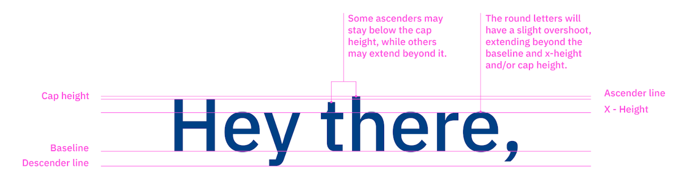
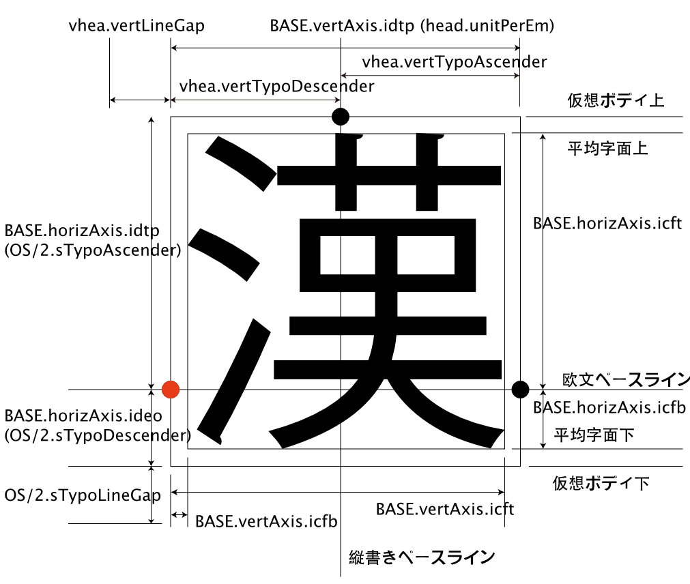
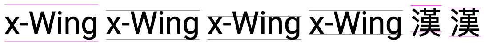
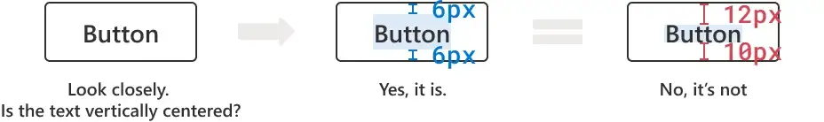
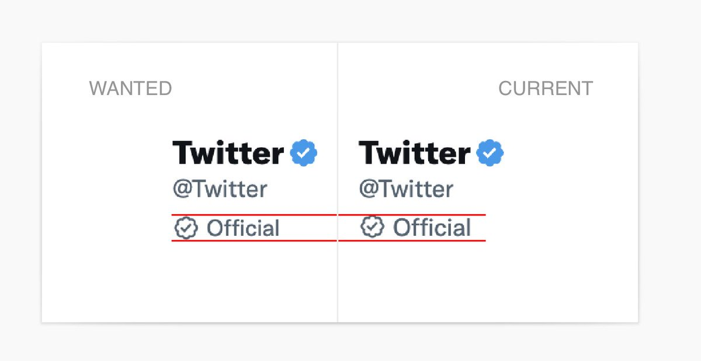
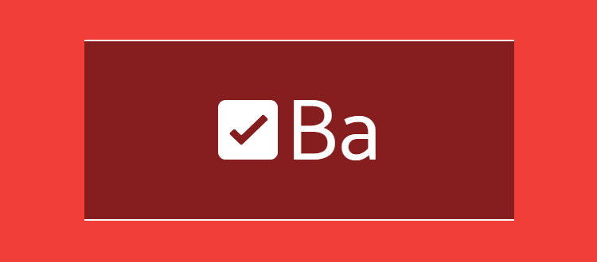
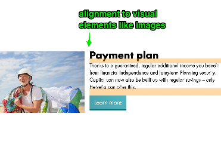
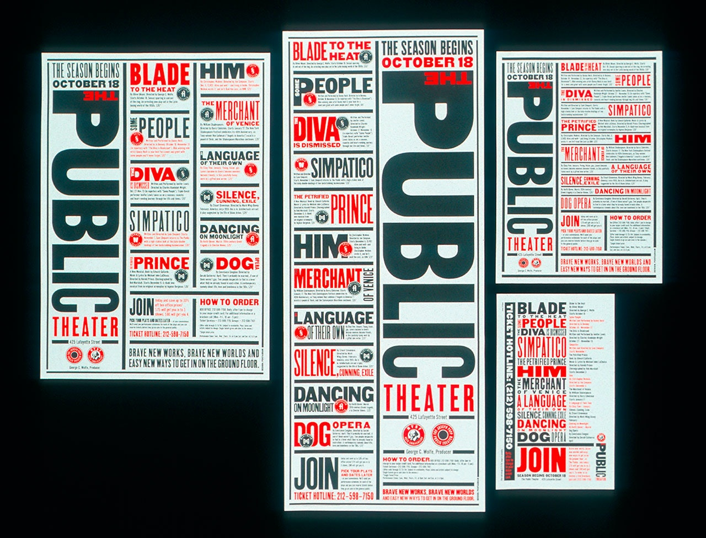

# Leading Trim

CSS Leading Trim is a CSS property that allows you to remove the leading whitespace from a block of text. This is useful for removing the space between the top of the text and the top of the container.

## Usage

```css
.leading-trim {
  leading-trim: both;
  text-edge: cap alphabetic;
}
```

[](https://medium.com/microsoft-design/leading-trim-the-future-of-digital-typesetting-d082d84b202)

[](https://en.99designs.it/blog/tips/typography-design/)

[](https://kanji-database.sourceforge.net/fonts/base.svg)

## Playground

leading-trim is not yet supported by any browser.  
But you can try it out right now in the **[playground](https://leading-trim.vercel.app/?c=FwJw9mAuAEDeBQ1oFpkA8DOxoBYAOaA3IisltABwHFKoC22AjAGzXwC+88AdAO4gBDPHgCmIOCSR0BaZLwCWAE0gALJhQAMbJEgBGYEIrHIANiIBmkbACYC0DGBNLoukwIDGAaxo68AxYryAHYA5qYWVrjaOtIgIcHI+pCQYAzQAG4CIAAU9ACUxJzwKowSOtBm-sFhkCDyaUkqPkiQImiQyCKKISLY7kLQre3N0O6OBthxutnWAKyzADSUjEsaBZLQsfFB2BojWwlJKWmZOfmFXHhlOpWBoci19diNI0MdXT19A2-7Wdu7Fy4ugArskwEFrn4AtUbHZ8EQOPAQWCIQA+ex+CEIcq3aoPOoNKBNDZvTrdXqjb5tSAjQIYPBuACe2GCTiCIkSJjAXkKAB4APT81G8wLpUZuDAYAC8ACJ+EJRCAZaiNrySiryjiRFVQtBebpxELBgTVfz1aq8BrNUhcfdHnRoPIMNABPZgSEehhWopoOzeNAAMIAZSD0Dw4EVkEZgxUAhgZkgzuBzpAIjoYHSIhjWepggxHmqjohIkzIGj5nBMAcMbj0F4Wf6EPTqbDqcC7kgAlc0a9jLMg2p3FNlvgAtFKtHyJSQStSF59IEM425XcTi8mxEpoXS4FU-BqKAA)**

## Playground Examples

[text-edges ](https://leading-trim.vercel.app/?c=BYRgBA3gUGYC4FMAecC0CAmBzBAuMANggIYYCWAdlgNwyEnlWpwBOZAtvgEYD2cwtAL5RgAJkh1EKdNjzxkcWrCKlKWZm05he-ISIDME2FLSYc%20ZEvqqmrDtz4Cow4ABYj86WbkBjYgAcwYgJ-YGIuBDgyHysVRnU7LR0nFwBWDxMZczAyDAQeLBYA4GjYhjUNe21HPWAANgyFLLlc-MLi6NRKAGsymwTNB11nKFHRgHoAKkmwYAQQhBYwAGc4AE8iZbBJ8agZ6Fh-Unj8AAYrdmIWLEozqwAzHgo0AHcEMixgOHwKHhZLggPJ5oZZkABecgA7Kd-Eg9FBeBg1h4jhgTmAQDC4SMoMsED4ok8PLwWHkWPgQLCVjwCLkwNcuAAKUSpVIAGjAkIAnByWakAJRWElk1BsT7fMDnOjCxaoIj3CVS2DkZb%20AjENb4Si0igIVBcAg8Hy9ZwAHnG4wAfFBTXiCWQntbYLBTaAnc6PUhUAB1NR0F3jN028Z2wkUa2jW34sPul1iWMesBe31Uf1gc3x4Ohh3hyPZx1p136BOen1%20j0Z4tZ6M5iNR%200FituEvO5Pl50Z1zW8353M23sJ12pFuwQBE9oXA8Pqw2%20-WY4X6iOwOOK4G6t2QzXHUA)


## Browser Support

[Can I use](https://caniuse.com/#feat=sr_leading-trim-text-edge)

| Browser | Version |
| ------- | ------- |
| Chrome  |    -    |
| Firefox |    -    |
| Safari  |    -    |
| Opera   |    -    |
| IE      |    -    |

## Proposal

https://github.com/w3c/csswg-drafts/issues/3240
https://www.w3.org/TR/css-inline-3/#propdef-leading-trim

## Examples

### Centering text in buttons

```css
button {
    padding: 6px
}
````



With leading trim:

```css
button {
  leading-trim: both;
  text-edge: cap alphabetic;
  padding: 10px
}
```


### Spacing Systems

Most design systems have a spacing system that is based on multiples of a base unit. For example, a spacing system might have a base unit of 4px, and then multiples of that unit, such as 8px, 12px, 16px, etc. This is a great way to ensure that spacing is consistent across the design system.

However the added line-height destroys the spacing system:


### Icons

Aligning icons with text is a common problem. With leading trim, you can align the icon with the text:

[](https://twitter.com/rauchg/status/1590375127136763907?s=46&t=YizBtCVEYqCeqBbJWI6quA)

[](https://iamvdo.me/en/blog/css-font-metrics-line-height-and-vertical-align)


### Images

In articles images are often placed next to images. The leading trim property allows you to remove the whitespace above the text to align the text with the image.

[](https://github.com/w3c/csswg-drafts/issues/3240)

### Art

Especially in logo design and art leading trim can be used to create aligned different text elements:

[](https://en.99designs.it/blog/tips/typography-design/)

## Related Links

- [w3.org leading-trim](https://www.w3.org/TR/css-inline-3/#leading-trim)
- [w3.org text-edge](https://www.w3.org/TR/css-inline-3/#text-edges)
- [Leading-Trim: The Future of Digital Typesetting](https://medium.com/microsoft-design/leading-trim-the-future-of-digital-typesetting-d082d84b202)
- [Typography design 101: a guide to rules and terms](https://en.99designs.it/blog/tips/typography-design/)
- [CapSize](https://seek-oss.github.io/capsize/)
- [Deep dive CSS: font metrics, line-height and vertical-align](https://iamvdo.me/en/blog/css-font-metrics-line-height-and-vertical-align)